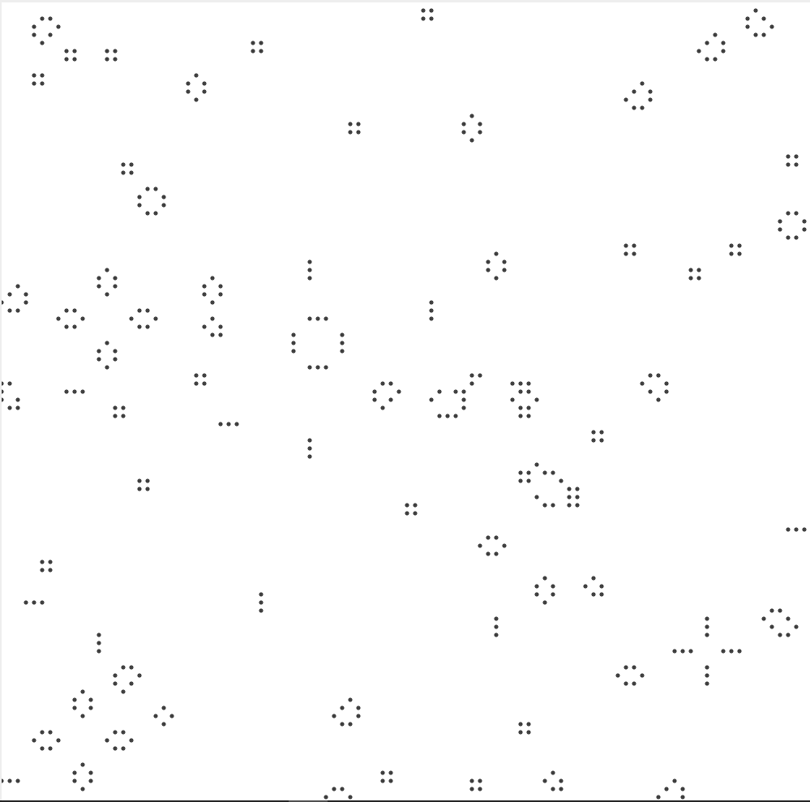

# Conway Game of Life

Created by dincrash(Vladislav Karpov)

The Game of Life, also known simply as Life, is a cellular automaton devised by the British mathematician John Horton Conway in 1970.

The game is a zero-player game, meaning that its evolution is determined by its initial state, requiring no further input. One interacts with the Game of Life by creating an initial configuration and observing how it evolves, or, for advanced players, by creating patterns with particular properties.

### Tech

I create conway game based on desktop app:
java 1.8
stdlib-package.jar library for graphic
https://introcs.cs.princeton.edu/java/stdlib/

### Installation

add stdlib-package.jar to library

### About program

main class include 3 version of game:
1. based on Array.
2. based on List.
3. based on HashSet.

size:
100x100
5000 life cell
canvas 1000x1000
 
